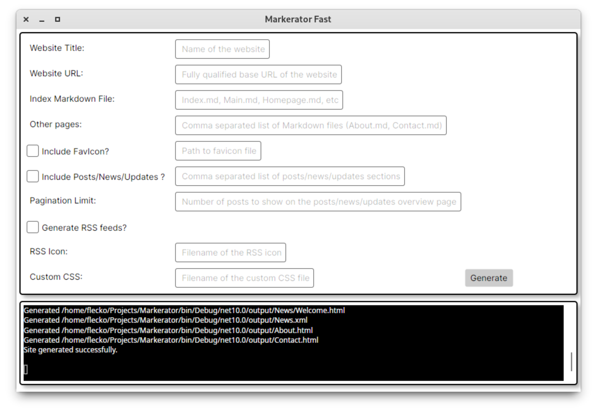

# 10/08/2026

## Move Fast and (maybe?) Break Things
In my relentless march on getting Markerator to a releasable v1.0.0, I'm going to spend today trying out some live experimental changes to it that may break this site for a bit. 

The thing I'll be testing out is a switch for a Light/Dark mode toggle that uses nothing but pure HTML/CSS. Because I'm refusing to use any Javascript, this will be on a per page basis, and won't be persisted. It's just a quality of life update for anyone that visits the site, and doesn't want their eyeballs burned by a light version of a theme.

I'm also going to add a few new theme variants, and work on the documentation a bit more. If all goes well, I'll be able to call this v1.0.0, and then move on to making a nice GUI for Markerator to make it even easier to use. I've already created a simplistic mock-up for the GUI. I plan on using C#/Avalonia for the GUI app, as it'll afford great widgets/controls, as well as cross platform compatibility at zero cost to me.

I'll be sure to update this post with my progress today as things change and potentially break. 